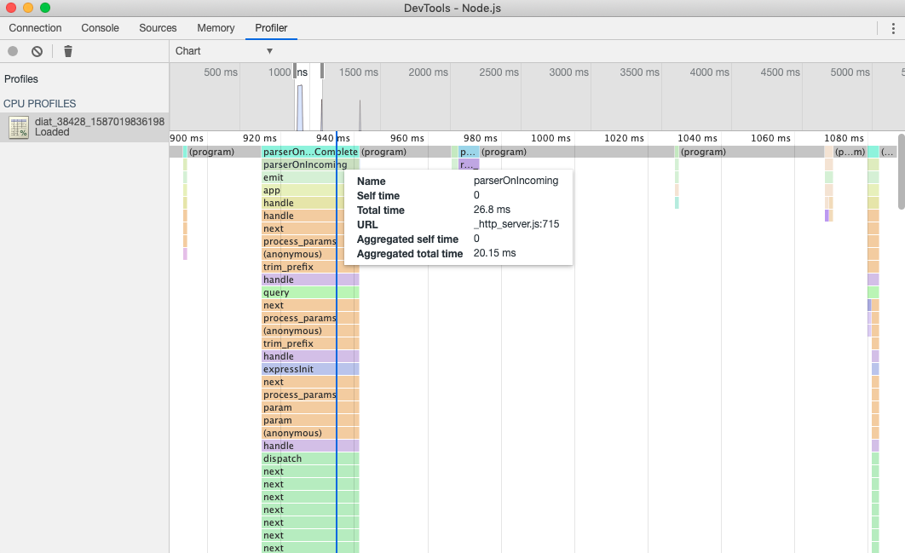
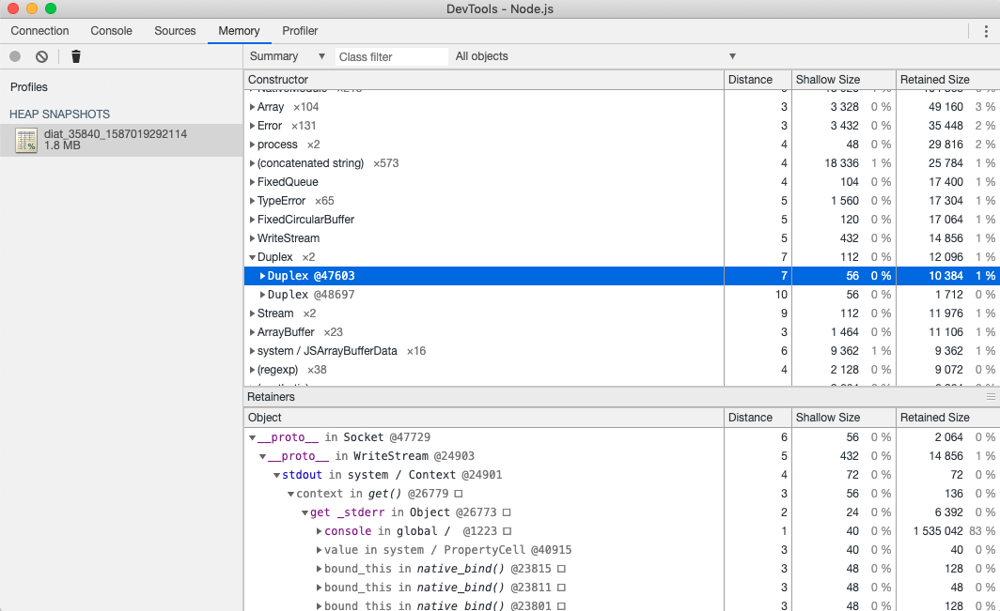

# diat

[](https://www.npmjs.com/package/diat)
[](https://www.npmjs.com/package/diat)


[[English Doc]](./README_EN.md)

diat 是基于 [inspector](https://nodejs.org/api/inspector.html) 模块（提供: cpuprofile, heapsnapshot, debug 等能力）用于协助 Node.js 进程进行问题诊断的 CLI 工具。可以将diat当成是具有更丰富特性的 `node-inspect`。

## 索引

- [动机](#动机)
  - [node-inspect相比于其他工具有什么优点](#node-inspect相比于其他工具有什么优点)
  - [diat相比于node-inspect做了什么改动](#diat相比于node-inspect做了什么改动)
  - [推荐的排查途径](#推荐的排查途径)
- [安装](#安装)
  - [Node.js版本支持](#Node.js版本支持)
- [使用场景介绍](#使用场景介绍)
  - [inspect](#inspect)
    - [关闭inspector](#关闭inspector)
  - [inspectworker](#inspectworker)
  - [repl](#repl)
  - [metric](#metric)
  - [cpuprofile](#cpuprofile)
  - [heapsnapshot](#heapsnapshot)
    - [其他V8内存相关的profile](#其他V8内存相关的profile)
  - [perfbasicprof & perf2svg](#perfbasicprof--perf2svg)
- [已知限制](#已知限制)
- [工作原理](#工作原理)
- [在Electron上使用](#在Electron上使用)
- [Contributing](#Contributing)
- [License](#License)

## 动机

在解决 Node.js 服务端应用中发生的问题的过程中，我们发现**Node.js/V8 原生的 inspector 模块是解决各类问题最有效的工具**（不考虑大量使用 addon 或排查其他底层 c/cpp 代码的情况），比如：用 cpuprofile 解决 cpu 使用率异常的问题；用 heapsnapshot 排查内存泄漏的问题等等；用Debugger 协议直接打 logpoint 甚至热更新代码来协助排查业务问题。

并且不少 Node.js 开发者都具有 web 开发的经验，也就是说开发者学习利用 Chrome Devtools 进行问题排查可能是成本的最低途径之一。

但在实践过程中仍然有一些问题困扰着我们，比如：
- 有些线上问题偶发且难以追踪、复现，开启 inspector 重启应用后问题消失
- 有些环境我们可以开启 inspector，但外网无法访问
- 非业务性质的线上问题诊断本身是一个重要但低频的场景，相比之下要求各个业务线事先统一接入一套诊断工具的成本较高

因此我们期望 diat 针对线上问题诊断的场景，能作为一个开箱即用的工具，围绕 Node.js/V8 inspector 的能力缩短 V8 inspector 的使用成本。

### node-inspect相比于其他工具有什么优点

相比于其他诊断工具，`node-inspect` 支持 `node-inspect -p $PID` 来对一个进程直接进行调试，这种模式的优点在于：

- 开箱即用，无需应用事先接入。因为在使用时通常不需要重启进程，所以对于偶发或难以复现的问题排查会有所帮助。
- 部分功能在进程的主线程阻塞时也可以工作，如V8 cpu profile。因为直接基于 inspector 协议，并且 Node.js 的 inspector server 是运行在独立的线程上。
- 需要消耗额外资源的命令在工具退出后会关闭，从而尽可能少给进程带来额外的资源消耗。因此也更适合用在生产环境上。

而对于windows或是其他不能用 `node-inspect -p $PID` 的场合，则需要配合 `--inspect` 使用。

### diat相比于node-inspect做了什么改动

diat 的代码本身就包含了一份改动过的 `node-inspect` 代码，通过 `diat inspect -r` 即可使用 `node-inspect`。相比于`node-inspect`，diat添加了更多功能和优化。一些与inspector server通信相关的优化包括：

- 支持开启 worker_threads 的 inspector server 并进行调试。
- 支持代理 inspector server 的服务到外部网络中，从而允许其他调试工具接入。
- 退出后关闭 inspector server 释放9229端口，避免在有多个 Node.js 进程（或者说 V8 实例）的场景下 9229 端口被一个进程占用。

而基于node-inspect新增的特性则包括：

- 除了生成 cpuprofile 和 heapsnapshot，还支持生成 heapprofile 和 heaptimeline 文件。
- 支持 `attachConsole` 来输出主线程中 `console` 输出的内容。
- 支持 `setLogpoint()` 来设置不会中断线程运行的 logpoint。logpoint 也是一种 breakpoint，所以可以通过 `clearBreakpoint()` 来清除。
- 支持 `getScripts()` 返回scripts的数据（而不是打印出来），从而可以在通过js表达式筛选自己需要的脚本，用于进程的文件很多的情况。
- 支持 `scriptSource(scriptId)` 返回一个js脚本完成的内容。

如果有适合放到 `node-inspect` 中的特性，我们会尝试提交PR到上游。

### 推荐的排查途径

1. 如果环境允许外部网络访问，推荐直接开启 inspector server 并用 debugger 工具接入
2. 否则再利用利用CLI提供的各类命令解决问题

## 安装

```
npm i diat -g && diat --help
```

### Node.js版本支持

||Node.js 8|Node.js 10|Node.js 12|
|---|---|---|---|
|版本支持|⚠️ 基本支持，但会有些限制|✅|✅|

## 使用场景介绍

你可以用下面的命令开启一个 Node.js 进程用于测试:

```
node -e "console.log(process.pid); setInterval(() => {}, 1000)"
```

### inspect

`inspect`命令用来打开一个进程的 inspector 用于直接调试。通常如果你能打开 inspector 并访问到，大部分问题都可以通过 inspector 协议上的功能解决。

```
diat inspect -p <PID>
```

成功后会返回如下信息：

```
inspector service is listening on: 0.0.0.0:56324
or open the uri below on your Chrome to debug: devtools://devtools/bundled/js_app.html?experiments=true&v8only=true&ws=10.90.39.11:56324/408b7bca-1000-4c1f-a91e-de44d460e5ae
press ctrl/meta+c to exit
```

当看到这样的信息后，你可以用调试工具接入`56324`端口，注意`0.0.0.0`需要换成可访问到的公网 ip。你也可以直接用 Chrome 打开后面的`devtools://`url 用 Chrome devtools 连接进程的 inspector。

`inspect`命令是通过发送 SIGUSR1 信号让 Node.js 内置的代码开启 inspector 端口，详情见[文档](https://nodejs.org/api/process.html#process_signal_events)。但出于安全考虑 Node.js 是让 inspector 监听`127.0.0.1`ip 地址，也就是外网无法访问。diat 在这基础之上做了个 tcp 代理让外网可以访问到进程 inspector，**也就是存在被恶意访问 inspector 的风险。因此需要仔细斟酌你的使用场景是否适用**。

排查结束用`ctrl/meta+c`退出 diat 进程后，diat 会关闭业务进程中的 inspector。如果 diat 进程异常退出没能关闭进程的 inspector 的话，因为 inspector 默认监听的是`127.0.0.1`端口，一般风险也不大。

#### 关闭inspector

你可以通过下列命令手动关闭一个端口上的inspector server，从而释放对应的端口：

```
diat inspectstop -a 127.0.0.1:9229
```

### inspectworker

目前社区缺少对 worker_threads 开启的线程进行调试的支持（[ndb](https://github.com/GoogleChromeLabs/ndb)支持）。`inspectworker`命令可以用来打开线程的 inspector 进行调试：

```
diat inspectworker -p <PID>
```

进程可以通过 worker_threads 打开多个线程，所以接入成功后首先要选择我们想要 inspect 的线程：

```
? Choose a worker to inspect (Use arrow keys)
❯ Worker 2(id: 1) [file:///diat/packages/diat/
__tests__/test_process/thread_worker.js]
  Worker 1(id: 2) [file:///diat/packages/diat/
__tests__/test_process/thread_worker.js]
```

选择相应的线程后，diat 会打开对应线程的 inspector，后续使用方式同`inspect`命令，可以参照[inspect](#inspect)中的描述。

因为目前 Node.js 对 worker_threads 中的 inspector 的支持有所缺失（或者说未来 worker_threads 的调试方式不一定是以 inspector 为主），所以目前 diat 打开线程中的 inspector 后无法关闭。

### repl

前面介绍了用 `inspect` 和 `inspectworker` 打开 inspector 的方式，但在一些环境中我们并不能用外部 debugger 接入，比如：网络隔离的情况。这种情况下我们可以利用 `-r` 配置在命令行上进行调试，如：

```
diat inspect -p <PID> -r
```

成功后输入 `help` 查看 `node-inspect` 支持的命令。关于 `node-inspect` 的详细信息可以查看文档：
- debugger https://nodejs.org/api/debugger.html
- node-inspect https://github.com/nodejs/node-inspect

### metric

`metric`命令用于查看进程占用的资源：

```
diat metric -p <PID>
```

开启后会展示 cpu、memory 和 uv 相关的一些基础数据：

```
[cpu] load(user): 0.00032 load(system): 0.000068
[memory] rss: 29.78MB heapTotal: 4.18MB heapUsed: 2.33MB external: 873.74KB
[uv] handle: 3, request: 0, latency: 5ms
```

数据每隔 2s 进行一次更新。

### cpuprofile

`cpuprofile`命令用于让进程进行 cpu prfile，从而生成.cpuprofile 文件记录一段时间内 js 中的函数执行情况。cpu profile 可以帮助我们排查 cpu 使用率过高的问题，或是用于协助进行性能分析：

```
diat cpuprofile -p <PID>
```

当.cpuprofile 文件生成成功后，diat 会返回文件所在的位置：

```
profiling...
cpuprofile generated at: /diat_90504_1584018222518.cpuprofile
```



你可以在 Chrome Devtools 中的 Profiler 面板中打开.cpuprofile 文件进行分析。关于 cpu profile 的使用说明可以参考 Chrome Devtools 的[官方文档](https://developers.google.com/web/updates/2016/12/devtools-javascript-cpu-profile-migration)。

cpuprofile 支持配置如下参数：

- `--duration` 表示采样的时间，默认为 5000ms。
- `--interval` 表示采样间隔，默认为 1000us。采样间隔越小，则 cpuprofile 越准确，但需要进程额外消耗的资源越多。

cpuprofile 默认的文件格式是：`./diat_$PID_$TS.cpuprofile`，可通过`--file`改变指定生成文件的名称。

### heapsnapshot

`heapsnapshot`命令用于生成.heapsnapshot 文件（堆快照）。heap snapshot 可以让我们了解进程中的内存占用细节，可以用来帮助我们排查内存泄漏问题：

```
diat heapsnapshot -p <PID>
```

你可以在 Chrome Devtools 中的 Memory 面板中打开.heapsnapshot 文件进行分析。关于 heap snapshot 的使用说明可以参考 Chrome Devtools 的[官方文档](https://developers.google.com/web/tools/chrome-devtools/memory-problems/heap-snapshots#view_snapshots)。



**注意：** 生成 heap snapshot 可能导致内存占用比较高的进程退出。因为没有指定参数的话，Node.js 进程在 64bit 机器上的 max-old-space-size 是 1.4GB 左右（Node.js 12 上的某个版本开始不再做这个默认的限制），而 heap snapshot 在生成的过程中会额外占用不少内存。此时继续增大内存占用会导致 V8 abort 或系统 OOM killer 关闭业务进程。对于这个问题暂时可能没有什么好的办法处理。

heapsnapshot 文件的默认格式是：`./diat_$PID_$TS.heapsnapshot`，可通过`--file`改变指定生成文件的名称。

#### 其他V8内存相关的profile

除了 heapsnapshot，还可以直接通过diat生成 heapprofile 文件：

```
diat heapprofile -p <PID> -d 5000
```

和 heaptimeline 文件：

```
diat heaptimeline -p <PID> -d 5000
```


其中 heap profile 不会阻塞线程、对进程影响较小，而 heap timeline 则可以获取到生成对象所对应的代码。更多细节可查看[官方文档](https://developers.google.com/web/tools/chrome-devtools/memory-problems/allocation-profiler)。

### perfbasicprof & perf2svg

cpu profile 对于排查 js 中与 cpu 相关的问题很有帮助。但是因为 cpu profile 是 V8 记录的 js 中的函数执行情况，所以对于 Node.js 底层代码中或 addon 代码中的函数调用情况，我们没办法通过 cpu profile 进行排查。如果发生这类问题我们需要 c/cpp 的 profile 进行排查。diat 对 Linux perf 方案提供额外的支持（可以参考[node.js Flame Graphs on Linux](http://www.brendangregg.com/blog/2014-09-17/node-flame-graphs-on-linux.html)）。

首先通过`perfbasicprof`让 Node.js 进程生成.map 文件，.map 文件让 perf 能识别 js 的函数：

```
diat perfbasicprof -p <PID> -e true
```

接着让 perf 对进程进行 profile：

```
perf record -F 1000 -p <PID> -g -m 512B -- sleep 5
```

成功后我们会在当前文件下找到 perf.data 文件，文件中描述了这段时间内进程中的函数调用。用 perf 再次处理以获取可以直接读取的内容：

```
perf script > out.nodestacks01
```

操作结束后让 Node.js 停止生成.map 文件，减少资源消耗：

```
diat perfbasicprof -p <PID> -e false
```

如果我们想生成 Flame graph，可以`perf2svg`用做进一步处理生成 svg：

```
diat perf2svg -f out.nodestacks01
```

## 已知限制

### 1. 无法在 Windows 上直接传入 PID

因为 Windows 不支持给进程发送信号打开 inspector，所以也就没办法用`-p`选项传入 pid。可以考虑在启动 Node.js 时增加`--inspect`打开 inspector 并在 diat 的命令中用`-a`/`--inspector_addr`配置替代`-p`配置传入 inspector 的地址，比如：

```
node --inspect=9229 index.js
```

然后用 diat“打开”inspector（实际上做的事情只是在公共 ip 代理 inspector 服务）：

```
diat inspect -a=127.0.0.1:9229
```

### 2. 9229 端口被占用后，无法通过 SIGUSR1 信号在默认的 9229 端口上打开 inspector

同样可以考虑在启动 Node.js 时增加`--inspect=PORT`指定一个可用的端口打开 inspector，并在 diat 的命令中用`-a`/`--inspector_addr`配置替代`-p`配置传入 inspector 的地址。

### 3. Node.js 8 版本中 inspector 的限制

Node.js 8 版本（目前已经退出 LTS）中的 inspector 有一些限制（这些问题不存在于 Node.js >= 10 的版本中），比如：

1. 同一时间只能有一个`inspector.Session`接入

因为这个限制的存在，也就意味着如果已经打开并接入了进程的 inspector 端口，比如：用 Chrome Devtools 接入。那后续接入 inspector 的尝试都会失败，diat 也就没办法生效。而有些工具，比如`pm2`中的某些配置，比如：`--max-memory-restart`，也会打开进程的 inspector 并接入，所以这种情况下新的接入也会失败。

## 工作原理

### 基本工作原理

1. 用 SIGUSR1 信号在 9229 端口上打开 inspector: https://nodejs.org/api/process.html#process_signal_events
2. 利用 v8-inspector(node) 协议进行通信，可以执行对应的 inspector 功能，包括执行一段指定的代码: https://chromedevtools.github.io/devtools-protocol/v8/HeapProfiler/

### inspectworker 的工作原理

除了 v8-inspector(node) 的协议外，Node.js 内部还有定义一些协议用于 trace 和 worker_threads 等功能，定义见：https://github.com/nodejs/node/blob/master/src/inspector/node_protocol.pdl

这些协议中包括和线程中的 inspector 进行通信的部分。diat 通过该协议让线程打开 inspector，从而允许外部接入。

### 在Electron上使用

你可以对 Electron 的 Node.js 进程使用 diat。因为工作原理对 Node.js 进程是通用的，所以理论上 diat 对于这类应用都是生效的。

## Contributing

项目使用 lerna 进行管理，`git clone` 项目后进行安装：

```
cd diat && npm install
```

packages 文件夹下的 linux-perf、node-inspect 和 stackvis-simplified 是对社区里面的项目进行了些改造的代码。diat 自身的代码主要在：

- packages/diat：命令行工具的主要代码
- packages/live-inspector：处理与 inspector 通信

提交代码前需要确保测试通过，并在 commit message 中描述对应的改动。测试可通过`npm run test`执行。

已知问题：目前因为 jest 在检测 worker_threads 开启的线程上似乎有些问题，可能导致测试无法自动退出。

## License

[MIT](./LICENSE)
